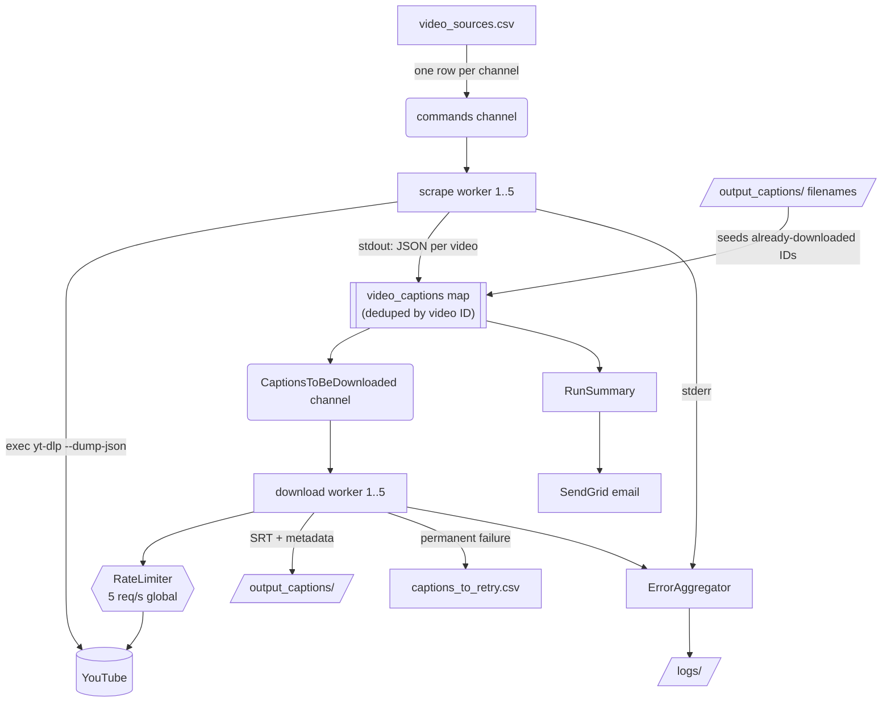

# council

A concurrent Go pipeline that harvests English closed-caption tracks from YouTube channels — built for archiving **city council meeting videos**, where the captions are the only machine-readable record of what was said.

Point it at a CSV of channels, and on every run it will:

1. fan out `yt-dlp` processes to discover videos published since the last run,
2. pull the auto-generated English SRT caption URL out of each video's JSON metadata,
3. download the caption files through a globally rate-limited worker pool,
4. record what it did (and what broke) in logs, a retry worklist, and optional summary emails.

It is designed to be run repeatedly — from cron, a systemd timer, or by hand — and to pick up exactly where the previous run stopped.

---

## Table of contents

- [How it works](#how-it-works)
- [Requirements](#requirements)
- [Installation](#installation)
- [Configuration](#configuration)
  - [`video_sources.csv`](#video_sourcescsv)
  - [Cookies](#cookies)
  - [Environment variables](#environment-variables)
- [Usage](#usage)
- [Output](#output)
- [Reliability](#reliability)
- [Logging](#logging)
- [Email reports](#email-reports)
- [Tuning](#tuning)
- [Project layout](#project-layout)
- [Development](#development)
- [Known gaps](#known-gaps)

---

## How it works

The run is two sequential stages, each internally concurrent. Stage 1 must finish
before stage 2 begins, so the full set of discovered videos is known before any
caption is fetched.



**Stage 1 — channel scraping (`commandmanager.go`).**
`readCSVToStructs` streams the channel rows into a buffered `commands` channel; five
worker goroutines drain it, and each one spawns its own `yt-dlp --dump-json` process via
`exec.CommandContext`. Because stdout and stderr are both blocking pipes, each worker
starts two child goroutines: one incrementally JSON-decodes stdout into
`VideoToBeDownloadedResult` values over a small bridge channel, the other scans stderr
and funnels every line into the `ErrorAggregator`. The worker's own select loop reads the
bridge channel, skips videos already present in the dedup map, and stores the rest.

**Stage 2 — caption downloading (`captiondownloader.go`).**
Once `WaitForAllWorkToFinish()` returns, the deduped map is streamed into the download
manager's job channel (from a goroutine, so the buffered channel can't deadlock on large
backfills). Five download workers pull jobs and fetch each SRT URL over HTTP, with every
attempt — first tries and retries alike — gated by a single shared `RateLimiter`.

**Incremental by design.** Two mechanisms keep repeat runs cheap:

- *Watermark*: each channel's newest seen `upload_date` is written back to
  `video_sources.csv`, and passed to the next run as `yt-dlp --dateafter`, so YouTube is
  never asked for old videos again.
- *Dedup*: at startup, `output_captions/` is listed and every video ID already on disk is
  seeded into the in-memory map, so a video that slips past the date filter still isn't
  re-downloaded.

---

## Requirements

| Dependency | Why | Notes |
|---|---|---|
| Go 1.24+ | build | Module `council`; no third-party dependencies — stdlib only |
| [`yt-dlp`](https://github.com/yt-dlp/yt-dlp) | video discovery + caption URLs | Must be on `PATH` |
| [Node.js](https://nodejs.org) | `yt-dlp --js-runtimes node` | YouTube's signature challenges need a JS runtime |
| `cookies.txt` | authenticated requests | Netscape-format export; see [Cookies](#cookies) |
| SendGrid API key | *optional* — email reports | Without it, emails are a logged no-op |

The `yt-dlp` binary name is chosen by `GO_ENV`: `yt-dlp_macos` when `GO_ENV=development`,
plain `yt-dlp` otherwise.

---

## Installation

```bash
git clone https://github.com/stanleeDK/council.git
cd council
go build -o council .
```

The runtime directories (`logs/application_logs`, `logs/error_logs`, `output_captions`)
are gitignored and created automatically on first run.

---

## Configuration

### `video_sources.csv`

The channel list, and also the durable state file — the app **rewrites it** after each
channel finishes. Lines beginning with `#` are comments and are skipped (a handy way to
park a channel without deleting it).

```csv
PLATFORM_SORUCE,COUNCIL_CITY_SOURCE,CHANNEL_URL,YOUNGEST_VIDEO_UPLOADED_AT,IS_RECENTLY_ADDED
youtube,citykenosha,https://www.youtube.com/@OfficialCityOfKenosha/streams,20260101,false
# youtube,santa_monica_ca,https://www.youtube.com/@Citytv16santamonica,20260101,false
```

| Column | Meaning |
|---|---|
| `PLATFORM_SORUCE` | Source platform. Currently informational; only YouTube is implemented. *(The typo is load-bearing — it's the real header.)* |
| `COUNCIL_CITY_SOURCE` | Short slug identifying the council/city. Used as the lookup key when the watermark is written back. |
| `CHANNEL_URL` | Anything `yt-dlp` accepts: a channel, an `/streams` tab, or a playlist. |
| `YOUNGEST_VIDEO_UPLOADED_AT` | `YYYYMMDD` watermark of the newest video seen. Passed as `--dateafter`; **updated by the app** after each run. |
| `IS_RECENTLY_ADDED` | `true` → ignore the watermark and backfill the **past year**. Automatically flipped to `false` once scraped, so the backfill happens exactly once. |

To onboard a new channel: append a row with `IS_RECENTLY_ADDED=true` and any date, then
run. The first run backfills a year; subsequent runs are incremental.

Writes are atomic (temp file + `rename`), so an interrupted run can never truncate the
channel list.

### Cookies

`yt-dlp` is invoked with `--cookies cookies.txt`. Export cookies for youtube.com from a
logged-in browser session in Netscape format and place the file in the project root. It is
gitignored — **never commit it**, it carries live auth tokens.

### Environment variables

| Variable | Effect |
|---|---|
| `GO_ENV` | `development` selects the `yt-dlp_macos` binary; anything else selects `yt-dlp` |
| `SENDGRID_API_KEY` | Enables the failure and run-summary emails. Unset ⇒ emails are skipped with a log line |

Sender and recipient addresses are constants (`emailTo`, `emailFrom`) at the top of
`email.go`; the sender must be SendGrid-verified.

---

## Usage

```bash
# Normal incremental run
./council

# Run and email a summary of everything scraped and downloaded
./council -e
```

| Flag | Default | Description |
|---|---|---|
| `-e` | `false` | Send the post-run summary email (channel/video/caption counts plus per-video upload dates). Failure emails are sent regardless whenever a run produces ERROR/CRITICAL records. |

**Cron example** — hourly, with a hard timeout so a wedged run can't overlap the next:

```cron
0 * * * * cd /srv/council && GO_ENV=production SENDGRID_API_KEY=... timeout 50m ./council >> /dev/null 2>&1
```

`SIGINT`/`SIGTERM` (Ctrl-C, `kill`, `timeout`, host shutdown) cancel the shared
`context.Context`, which propagates to every `yt-dlp` child process and in-flight HTTP
request — so the app shuts down without orphaning processes or half-writing state.

---

## Output

Caption files land in `output_captions/`, one per video:

```
<YOUTUBE_CHANNEL_NAME>___<VIDEO_ID>___<YYYY-MM-DDTHH-MM-SS>
```

Note that the first field is the channel name as YouTube reports it in the video's
metadata — not the `COUNCIL_CITY_SOURCE` slug from the CSV. The download timestamp is when
the file was written, not when the video was published.

The triple-underscore delimiter is what the startup dedup scan parses, so **don't rename
these files** if you want dedup to keep working.

Each file is a metadata header immediately followed by the raw SRT body:

```
City of Kenosha,dQw4w9WgXcQ,2026-01-04 00:00:00 +0000 UTC,https://www.youtube.com/api/timedtext?...,https://www.youtube.com/watch?v=dQw4w9WgXcQ1
00:00:01,000 --> 00:00:04,000
good evening and welcome to the regular meeting of the city council
...
```

(The header is comma-separated: channel, video ID, upload date, caption URL, video URL.
It is written without a trailing newline, so the SRT's first line continues it.)

---

## Reliability

The pipeline is built so that one bad channel or one throttled request never takes down
the run.

- **Global rate limiting.** A single `time.Ticker`-backed `RateLimiter` is shared by all
  caption workers, capping aggregate throughput at 5 req/s regardless of worker count.
  This deliberately decouples I/O parallelism from request rate — the latter is what
  YouTube throttles on.
- **Retries with backoff.** HTTP 429 and 5xx are retried up to 3 times. A `Retry-After`
  header is honoured when present; otherwise backoff is exponential (1s → 2s → 4s, capped
  at 8s) with full jitter. Other statuses (403/410 — typically an expired URL) fail fast.
  The cap is deliberate: caption URLs carry an `expire=` parameter, so a long sleep just
  trades a 429 for an expiry error.
- **Durable retry worklist.** Captions that fail permanently are recorded in
  `captions_to_retry.csv`, keyed by **video URL** (not caption URL, which expires) so the
  entry is still actionable later. Successes prune their entry, so the file only ever
  holds outstanding failures. Written once per run, atomically.
- **Isolated failures.** A `yt-dlp` process that fails to start, dies, or emits malformed
  JSON is recorded against its channel and skipped; the other four workers carry on.
- **Atomic state writes.** `video_sources.csv`, `captions_to_retry.csv`, and log pruning
  all use temp-file + `rename`, which is atomic on the same filesystem.
- **Failing command capture.** Channel-level errors log the complete `yt-dlp` invocation,
  so a failing command can be copy-pasted and re-run by hand.

---

## Logging

| Path | Contents |
|---|---|
| `logs/application_logs/app.log` | Everything, mirrored to stdout via an `io.MultiWriter` |
| `logs/error_logs/errors.log` | Only `ERROR` and `CRITICAL` records — the greppable list of things that need attention |

All errors flow through the `ErrorAggregator` (`errorhandler.go`), a buffered channel
consumed by a dedicated goroutine, so recording an error never blocks a worker. Each
record carries timestamp, severity (`INFO`/`WARNING`/`ERROR`/`CRITICAL`), worker ID,
channel, URL, component, and message:

```
[ERROR] Worker:2 Channel:citykenosha Component:network URL:https://youtube.com/watch?v=... - Unexpected HTTP status code when fetching caption (retries exhausted): unexpected status code: 429
```

**Retention.** On every startup, before the loggers open the files, lines older than
**14 days** are pruned from both logs (atomically). Caption output is never touched.

---

## Email reports

Both reports are best-effort: a missing key, missing address, or transport failure is
logged and never crashes the run.

- **Failure report** — sent automatically whenever a run produced any ERROR/CRITICAL
  record. Lists each failure with its severity, timestamp, channel, component, URL, and
  message, and points at `logs/error_logs/errors.log` for the full record.
- **Run summary** — sent only with `-e`. Channels scraped, videos discovered, and captions
  written, each with the video's YouTube upload date.

---

## Tuning

Constants, not flags — they live at the top of their respective files.

| Knob | Location | Default | Notes |
|---|---|---|---|
| `numWorkersforChannels` | `main.go` | `5` | Used for **both** pools: channel scrapers and caption downloaders |
| `captionRequestsPerSecond` | `captiondownloader.go` | `5.0` | The main dial. Start conservative, watch your 429 rate, raise until you find the ceiling |
| `captionMaxRetries` | `captiondownloader.go` | `3` | Retries *in addition to* the first attempt |
| `captionBaseBackoff` / `captionMaxBackoff` | `captiondownloader.go` | `1s` / `8s` | Capped because caption URLs expire |
| `captionHTTPTimeout` | `captiondownloader.go` | `30s` | Per-request timeout |
| `logRetention` | `main.go` | `14 days` | Log line age cutoff |

---

## Project layout

```
main.go                 Entry point: flags, signal handling, directory + log setup, stage sequencing
commandmanager.go       Stage 1 — CSV parsing, yt-dlp worker pool, dedup map, watermark persistence
captiondownloader.go    Stage 2 — caption worker pool, HTTP fetch, retry/backoff, file writing
ratelimiter.go          Shared ticker-based global rate limiter
retryworklist.go        Durable worklist of permanently-failed caption downloads
errorhandler.go         Centralized, concurrency-safe error aggregation and severity-split logging
runsummary.go           Per-run stats collection for the summary email
email.go                SendGrid transport plus failure/summary report rendering
logmaintenance.go       Age-based log pruning
types.go                ChannelToBeScraped, VideoToBeDownloadedResult
video_sources.csv       Channel list and watermark state
```

---

## Development

```bash
go build ./...
go vet ./...
```

**Resetting local state.** `commandmanager_test.go` holds a destructive helper rather than
a unit test: it resets every channel's watermark to `20260101` with
`IS_RECENTLY_ADDED=false`, deletes `app.log`, and empties `logs/error_logs/` and
`output_captions/`. It exists to recover a clean slate after a run spoiled by rate
limiting.

```bash
go test -run TestResetTestEnvironment    # DESTRUCTIVE: wipes captions, logs, and CSV dates
```

`main.go` also carries commented-out scaffolding — a `pprof` HTTP server and a
`debugGoroutines()` ticker that prints the live goroutine count — for diagnosing goroutine
leaks.

---

## Known gaps

- **No retry runner.** `captions_to_retry.csv` is faithfully maintained but nothing
  consumes it yet; the planned `-r` flag would re-dump each video URL to mint a fresh
  caption URL and retry the download.
- **Worker count is one constant for two pools.** Scrape and download concurrency can't be
  tuned independently without editing the code.
- **English only.** The caption extractor looks specifically for the `en` track in `srt`
  format within `automatic_captions`; videos with no such track are logged and skipped.
- **Email addresses are compile-time constants** in `email.go` rather than environment
  variables.
